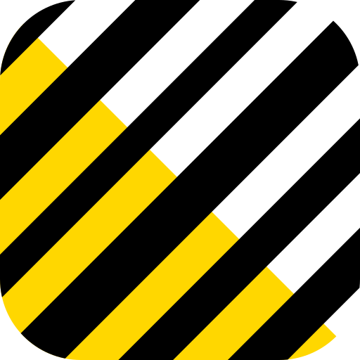

# ZPLKit




[](https://github.com/jonathanspiva/zplkit/actions/workflows/ci.yml)
[](https://claude.ai/code)

A Swift library for generating and rendering ZPL (Zebra Programming Language) labels. Build labels with a declarative, type-safe API and preview them instantly without a physical printer.

## Features

### ZPLKit (Generation)

- **Declarative API** using Swift result builders
- **Text** with fonts, rotation, reverse print, and baseline positioning
- **TextBlock** for multi-line text with word wrapping
- **Barcodes**: Code 128, Code 39, QR Code, DataMatrix, PDF417, Aztec, EAN-13, EAN-8, UPC-A, UPC-E, Interleaved 2 of 5, USPS Intelligent Mail
- **Shapes**: Box, Circle, Ellipse, Horizontal line, Vertical line, Diagonal line
- **Graphics**: Render CGImages to monochrome bitmaps with dithering (Floyd-Steinberg, Atkinson) and aspect-fill cropping
- **Serial numbers**, comments, printer commands
- **Unit-agnostic dimensions**: inches, millimeters, or dots
- **Full Swift 6 concurrency support** (`Sendable` types throughout)

### ZPLKitRenderer (Previews)

- **Native Swift renderer** with no external dependencies
- **Parse ZPL strings** into structured element trees
- **Render to PNG** for instant label previews
- **Bundled Roboto Condensed Bold font** for accurate Font 0 rendering

### ZPLKitPrinter (Network Printing)

- **Send ZPL to printers** over TCP (port 9100)
- **Network discovery** of Zebra printers via Zebra's UDP protocol (port 4201), not Bonjour, which Zebra units don't advertise
- **Printer configuration** with type-safe enums, presets, and zero-touch setup
- **Query printer status**, info, memory, and full configuration
- **Diagnostics** combining status, info, memory, and settings in one call
- **Control commands**: calibrate, feed, cancel jobs, print config labels
- **Async/await API** with configurable timeout

### ZPLKitVerifier (Validation)

- **Barcode verification** using Vision framework
- **Text OCR** to verify label content

```swift
import ZPLKitVerifier

let verifier = ZPLVerifier()

// Discovery mode: find every barcode and text region in a rendered image.
let result = try await verifier.analyze(cgImage)
for barcode in result.barcodes {
    print("\(barcode.symbology): \(barcode.payload)")
}

// Assertion mode: declare what the label must contain.
let check = try await verifier.verify(cgImage) {
    BarcodeExpectation(.qr, containing: "SKU-123")
    TextExpectation("FRAGILE")
}
if !check.passed {
    print(check.summary)
}
```

### Test Fixtures

- **125 ZPL files** covering text, barcodes, shapes, and graphics
- **Reusable test suite** for validating any ZPL parser or renderer
- **Reference images** from Labelary for comparison

## Installation

Add ZPLKit to your `Package.swift`:

```swift
dependencies: [
    .package(url: "https://github.com/jonathanspiva/zplkit.git", from: "1.0.0")
]
```

Then add the products to your target:

```swift
.target(name: "YourTarget", dependencies: ["ZPLKit"])

// For rendering support:
.target(name: "YourTarget", dependencies: ["ZPLKit", "ZPLKitRenderer"])

// For network printing:
.target(name: "YourTarget", dependencies: ["ZPLKit", "ZPLKitPrinter"])
```

## Quick Start

```swift
import ZPLKit

let label = ZPLLabel(width: 4, height: 6, dpi: .dpi203) {
    Text("PARTS BIN A-7", at: .inches(0.25, 0.25))
        .font(.default, height: .inches(0.2))

    Barcode128("BIN-A7-001", at: .inches(0.25, 0.6))?
        .height(.inches(0.5))
        .showText(true)

    Box(at: .inches(0.2, 0.2), width: .inches(3.5), height: .inches(1.2))
        .thickness(2)
}

let zpl = label.render()
// Send `zpl` to your Zebra printer
```

## Graphics and Dithering

Print photographs and images with dithering for natural-looking halftones on thermal printers:

```swift
import ZPLKit

let label = ZPLLabel(width: 4, height: 6, dpi: .dpi203) {
    Graphic(photo, at: .dots(0, 0), width: .inches(4), height: .inches(6))
        .dither(.floydSteinberg)
        .contentMode(.aspectFill)
}
```

Available dither methods:
- `.none` - Hard threshold at 128 (default, best for icons and line art)
- `.floydSteinberg` - Error diffusion dithering (best for photographs)
- `.atkinson` - Lighter dithering that preserves more whites (good for text-heavy images)
- `.threshold(n)` - Custom threshold value (0-255)

## Rendering Previews

```swift
import ZPLKitRenderer

let renderer = ZPLRenderer()
// renderToPNG derives the pixel size from the label's ^PW/^LL geometry.
if let pngData = (try? renderer.renderToPNG(zpl))?.data {
    // Display in UIImageView, save to file, etc.
}
```

## Printing

```swift
import ZPLKitPrinter

// Send to a known printer
let printer = ZPLPrinter(host: "192.168.1.100")
try await printer.send(label.render())

// Or discover printers on the network
let browser = ZPLPrinterBrowser()
for await discovered in browser.printers {
    try await ZPLPrinter.send(zpl, to: discovered)
    break
}
```

## Printer Configuration

Configure a new or factory-reset printer entirely through code:

```swift
import ZPLKitPrinter

let printer = ZPLPrinter(host: "192.168.1.100")
let info = try await printer.queryInfo()

let dpmm = info.dotsPerMillimeter
let config = PrinterConfiguration.directThermal(
    widthDots: dpmm * 102,    // 4 inches
    lengthDots: dpmm * 51     // 2 inches
)
.printerName("Warehouse-01")
.darkness(20)

try await printer.setup(config)  // apply + save + calibrate
```

Use presets for common setups, or configure individual settings:

```swift
// Only change what you need (other settings are left alone)
let darkConfig = PrinterConfiguration()
    .darkness(25)
    .printSpeedIPS(6)

try await printer.apply(darkConfig)
```

Query printer status before printing:

```swift
let status = try await printer.queryStatus()
if status.isReadyToPrint {
    try await printer.send(label.render())
}
```

## Documentation

- **[Getting Started](Sources/ZPLKit/Documentation.docc/Articles/GettingStarted.md)** - Full API reference with examples for all elements
- **[Test Fixtures](Sources/ZPLKit/Documentation.docc/Articles/Fixtures.md)** - 125 ZPL files for testing parsers and renderers
- **[Hardware Validation](HARDWARE-VALIDATION.md)** - Printers and firmware ZPLKit is tested against, with real-device response fixtures

## Known Issues

### `send()` uses POSIX sockets, not Network.framework (deliberate)

`ZPLPrinter.send()` uses POSIX sockets (`socket`/`connect`/`write`/`close`) instead of Apple's Network.framework (`NWConnection` or the newer Swift-native `NetworkConnection`). This is **intentional and load-bearing**. Do not "modernize" it without the verification below.

**Why:** Network.framework's connection teardown discards the print job on real Zebra printers. The connection closes before the printer commits the buffered data (the classic RST-on-close behavior), so labels silently fail to print. POSIX `close()` sends a clean TCP FIN the printer commits reliably, across all payload sizes and Apple platforms.

**The trap (recorded so it isn't repeated):** on 2026-07-15 a `NetworkConnection`-based `send()` was written and merged (PR #4). It **passed a loopback flush test and the automated live-printer suite**, then intermittently dropped jobs on a real GX420t and ZM400. It was reverted. The failure is not reproducible against a loopback socket, only against physical hardware. The decisive test: send **identical bytes** to port 9100 two ways, via `printf ... | nc <printer> 9100` (prints reliably) and via the candidate `send()` (dropped the job). **If you ever revisit this, verify on a physical printer with that A/B test, not a socket or a unit test.**

`query()` does use the Swift-native `NetworkConnection` API. There the connection stays open to receive the printer's response, so the teardown race doesn't apply, and it is verified reliable.

### `^NS` network reconfiguration is experimental (unverified on hardware)

Setting a printer's IP/subnet/gateway via `PrinterConfiguration.networkConfig(...)` / `dhcp()` (ZPL `^NS`) is **experimental and not verified working.** ZPLKit emits a spec-shaped `^NS` command (unit-tested), but in a 2026-07-23 round-trip on a GX420t (firmware V56.17.17Z) an `^NSP` static-IP change followed by `~JR` (`powerOnReset()`) did **not** change the printer's IP; it stayed put. The cause is undetermined: it may need a full power cycle rather than `~JR`, or the emitted format may differ from what this firmware accepts. A wrong value can also drop the printer off the network. **Verify on a recoverable printer (physical/USB access) before relying on this.**

## Renderer command support

`ZPLKitRenderer` is a *preview* renderer. It implements the commands ZPLKit
generates plus the common ones you meet in hand-written ZPL. Anything not listed
is ignored rather than rejected, so a label using it still renders, just without
that effect.

**Supported:** `^XA` `^XZ` `^PW` `^LL` `^LH` `^PO` `^PQ` `^MD` `^FO` `^FT` `^FS`
`^FD` `^FH` `^FR` `^FB` `^FW` `^A` `^CF` `^BY` `^GB` `^GC` `^GD` `^GE` `^GF`,
and the barcode commands `^BC` `^B3` `^BQ` `^BX` `^B7` `^B2` `^BE` `^B8` `^BU`
`^B9` `^B0` `^BZ`.

**Not implemented** (parsed and skipped):

| Command | Effect on a printer | Consequence in the preview |
|---|---|---|
| `^LR` | Reverses print for every field | Fields render normally. Labelary ignores this too, so there is no reference to validate against |
| `^CI` | Selects the character encoding | Field data is always treated as UTF-8, which is what ZPLKit emits (with `^CI28`) |
| `^CC` / `^CT` | Changes the `^` / `~` command prefix characters | A label that remaps its prefixes will not parse at all |
| `^GFB` with raw binary | Embeds an uncompressed bitmap | Payload bytes equal to `^` (0x5E) or `~` (0x7E) terminate the command early and corrupt the image. Inherent to string-based parsing; use `^GFA` or `^GFC` instead |

The interpretation line under a barcode is drawn in a generic font rather than
the printer's OCR-B-style face, so its glyphs and spacing differ from a printed
label even when the encoded data matches.

## Known Limitations

- **DataMatrix and Intelligent Mail** generate valid ZPL but render as labeled placeholder boxes in the renderer *preview* (CoreImage has no DataMatrix generator, and a pixel-accurate Intelligent Mail preview encoder isn't implemented); the printer encodes both from the ZPL. Note: Intelligent Mail generation is spec-correct (`^BZ` postal type 3, with the Barcode Identifier validated), but a printed symbol's **scannability has not yet been confirmed with an IMb-capable scanner**.
- **Fonts**: only Font 0 (Roboto Condensed Bold) is bundled. Any other font selection falls back to Font 0 in the renderer preview.
- **2D barcode previews**: QR, PDF417, Aztec, and Code 128 rendering depend on CoreImage, so preview rendering of those symbologies requires an Apple platform.

## Requirements

- Swift 6.3+
- iOS 26+ / macOS 26+ / tvOS 26+ / watchOS 26+
- **Linux**: `ZPLKit` (ZPL generation) builds and runs on Linux with Swift 6.3,
  and its test suite runs there too. Generated ZPL is byte-identical to macOS,
  and CI verifies both on every push. On a non-Darwin host the package declares
  only `ZPLKit`, because the other three products are Apple-only by design:
  `ZPLKitRenderer` needs CoreGraphics, `ZPLKitVerifier` needs Vision, and
  `ZPLKitPrinter` needs Network. So you can build labels on a Linux server, but
  not preview, verify, or send them.
- **`ZPLKitVerifier` is unavailable on watchOS.** It is built on Vision, whose
  Swift API (`DetectBarcodesRequest`, `RecognizeTextRequest`) requires watchOS 27
  while ZPLKit's floor is 26. The module compiles to an empty module there, so
  `ZPLKit`, `ZPLKitRenderer`, and `ZPLKitPrinter` all work on watchOS but
  verification does not.

The floor tracks the newest generally-available OS release rather than the current beta, so ZPLKit installs on a shipping toolchain. It is still deliberately narrow: ZPLKit uses the modern Swift concurrency, Vision, and Network APIs directly rather than carrying back-compatibility shims. If you need wider platform support, pin to a fork rather than expecting older-OS compatibility.

## Resources

- [Zebra ZPL Programming Guide](https://www.zebra.com/content/dam/zebra/manuals/printers/common/programming/zpl-zbi2-pm-en.pdf)
- [Labelary](https://labelary.com/viewer.html) - Online ZPL viewer

## Acknowledgements

ZPLKit bundles the Roboto Condensed font (Google / Christian Robertson), licensed under the Apache License 2.0. See [`NOTICE`](NOTICE) and [`Sources/ZPLKitRenderer/Resources/Roboto-LICENSE.txt`](Sources/ZPLKitRenderer/Resources/Roboto-LICENSE.txt) for details.

ZPL, Zebra Programming Language, and Zebra are trademarks of Zebra Technologies Corporation. ZPLKit is independent and unaffiliated.

## License

MIT
